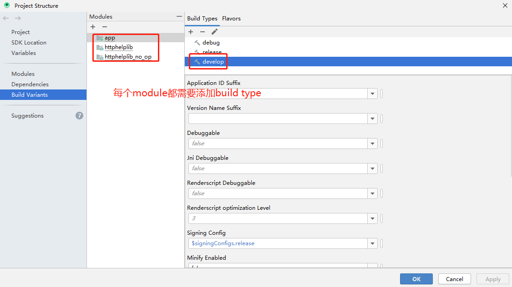
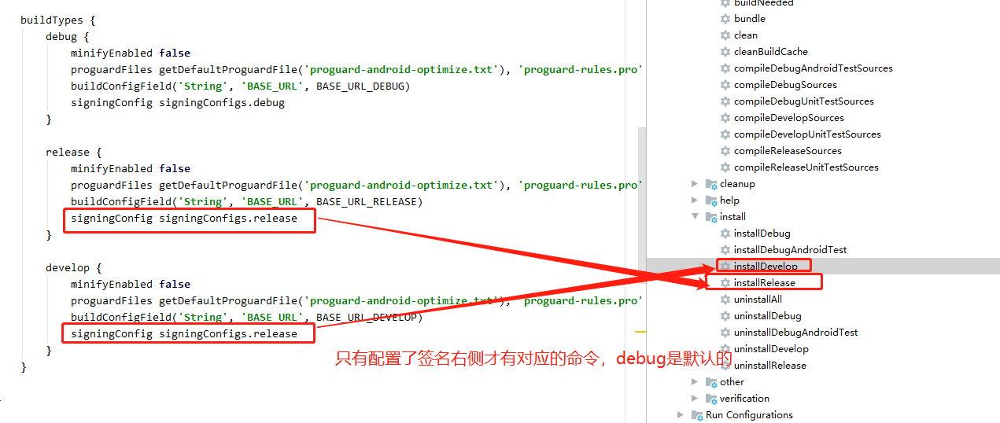

# 最新版本

)

# 感谢

[ DingProg / NetworkCaptureSelf ](https://github.com/DingProg/NetworkCaptureSelf)


# httphelper

root的app.gradle中配置：

```groovy
allprojects {
    repositories {
        //...
        maven { url 'https://jitpack.io' }
    }
}
```
app.gradle中配置：

```groovy
dependencies {
	implementation 'com.github.Ablexq:HttpHelper:1.0.0'
}

```
3. 代码中配置：
```
//添加域名配置拦截器，可直接在手机上进行切换域名
okHttpClient = new OkHttpClient.Builder()
        .addInterceptor(new HostInterceptor())
        .build();
```

```
//添加日志拦截器，可直接在手机上进行查看日志
okHttpClient = new OkHttpClient.Builder()
        .addInterceptor(new CaptureInfoInterceptor())
        .build();
```


# 其他

- 问题一：build type需要每个module都添加



新增的build type 每个module都需要添加


- 问题二：gradle面板没有相关的build type命令

```

Task 'installRelease' not found in root project 'HttpHelper'. Some candidates are: 'uninstallRelease'.

```
为什么gradle命令面板没有installRelease，因为需要配置签名才能执行installRelease

解决：



只有配置了签名，release和其他build type才会有右侧的执行按钮

- 问题三 ： 两个library怎么区分依赖


[如何通过Android Studio将项目发布到GitHub并同步到JitPack仓库？](https://www.jianshu.com/p/86a461ac154c)

[jetpack官网](https://jitpack.io/#Ablexq/HttpHelper)

[android集成jetpack官网指南](https://jitpack.io/docs/ANDROID/)

按照步骤上传后，如何引入呢？

先按照以下引入：	        
``` 
implementation 'com.github.Ablexq:HttpHelper:Tag'
```

报错：

```
* What went wrong:
Execution failed for task ':app:checkDevelopDuplicateClasses'.
> 1 exception was raised by workers:
java.lang.RuntimeException: 
Duplicate class com.example.httphelplib.BuildConfig found in modules jetified-httphelplib-1.0.0-runtime.jar 
(com.github.Ablexq.HttpHelper:httphelplib:1.0.0) and 
jetified-httphelplib_no_op-1.0.0-runtime.jar 
(com.github.Ablexq.HttpHelper:httphelplib_no_op:1.0.0)
Duplicate class com.example.httphelplib.host.HostInterceptor found in modules jetified-httphelplib-1.0.0-runtime.jar 
(com.github.Ablexq.HttpHelper:httphelplib:1.0.0) and 
jetified-httphelplib_no_op-1.0.0-runtime.jar 
(com.github.Ablexq.HttpHelper:httphelplib_no_op:1.0.0)
Duplicate class com.example.httphelplib.log.CaptureInfoInterceptor found in modules jetified-httphelplib-1.0.0-runtime.jar
 (com.github.Ablexq.HttpHelper:httphelplib:1.0.0) and 
jetified-httphelplib_no_op-1.0.0-runtime.jar (com.github.Ablexq.HttpHelper:httphelplib_no_op:1.0.0)

Go to the documentation to learn how to <a href="d.android.com/r/tools/classpath-sync-errors">Fix dependency resolution errors</a>.
```

可看到httphelplib和httphelplib_no_op相同包名，不能共存，使用以下解决即可：

``` 
debugImplementation  'com.github.Ablexq.HttpHelper:httphelplib:1.0.0'
developImplementation  'com.github.Ablexq.HttpHelper:httphelplib:1.0.0'
releaseImplementation 'com.github.Ablexq.HttpHelper:httphelplib_no_op:1.0.0'
```


